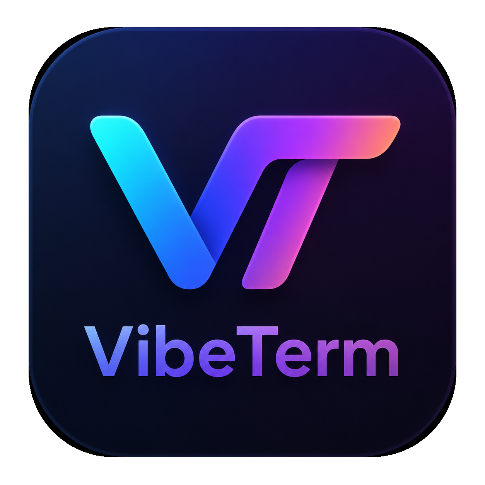

# VibeTerm

**为了更好 VibeCoding 而 VibeCoding 出来的终端项目**

一个更贴近日常开发节奏的 Windows 终端：
更顺手的多窗格工作流，
更统一的原生界面体验，
以及持续打磨中的现代 Shell、Nerd Font 与 Prompt 主题适配。

---

## 为什么是 VibeTerm

VibeTerm 不是为了做一个传统意义上“什么都往里塞”的终端，
而是希望围绕真实的 VibeCoding 使用方式，做一个更顺手、更统一、更有氛围感的终端工作区。

它更关注这些事情：

- 在一个窗口里自然地组织多个任务上下文
- 在标签页与窗格之间快速切换思路
- 让终端本身的视觉风格更统一，而不是只是一个裸容器
- 更好地适配现代 Shell、Nerd Font、Prompt 主题与 TUI 工具

## 项目特点

- 原生 Iced + alacritty_terminal 渲染路径
- 多窗格终端布局
- 自动选择可用 Shell 启动终端
- 基础键盘输入、粘贴与鼠标上报支持
- Windows 安装包与资源管理器右键菜单集成
- 针对 Windows 使用体验做了较多优化

## 当前状态

VibeTerm 当前以原生 Rust/Iced 实现为主。旧 Web 前端资源已经从主线移除；
部分框架无关的会话、设置、更新和 IPC 模块仍保留，
用于后续逐步接入原生 UI。

## 说明

- 当前项目主要围绕 Windows 场景持续优化
- 安装包与更新能力基于 GitHub Releases
- 一些终端显示细节（尤其是字体、图标、TUI 适配、设置界面）仍在持续打磨中

## License

MIT
